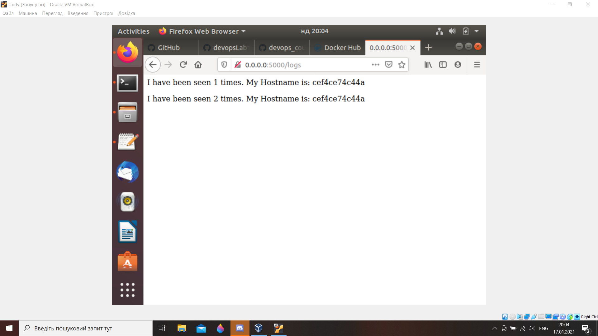
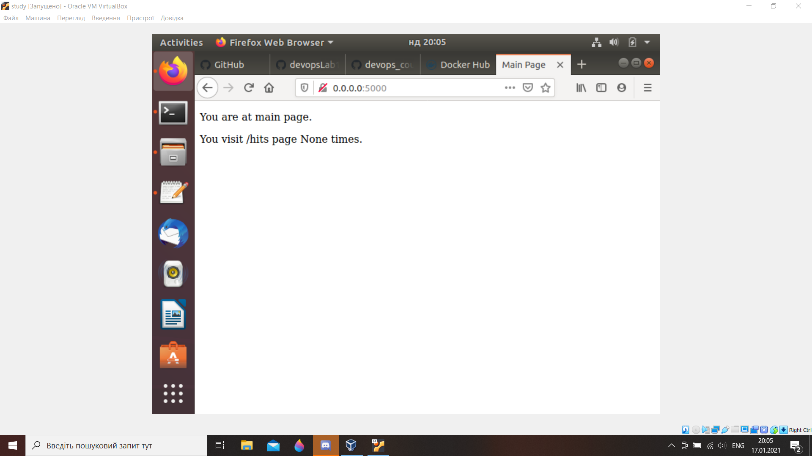
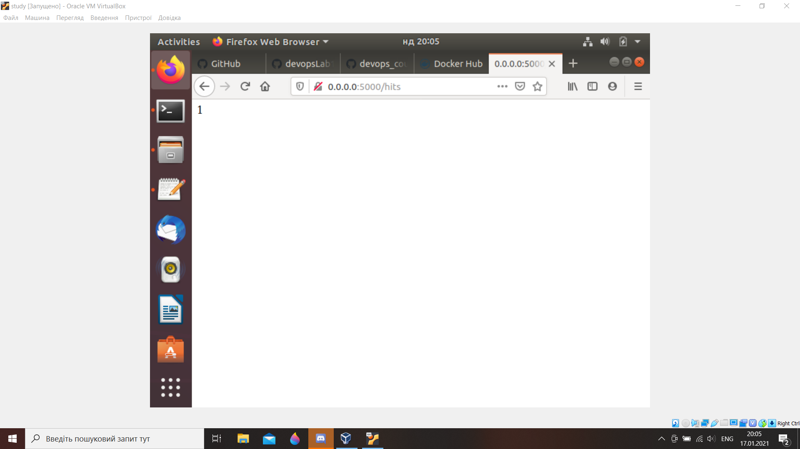

1. Did the following commands and project is not working:
    ```
    pipenv --python 3.9
    pipenv install -r requirements.txt
    pipenv run python3 app.py
2. It failed...:
    ```
    pipenv run pytest test_app.py --url http://localhost:5000

3. it failed because of redis-server absence

4.  Makefile:  
    1)STATES - variable to save the directives;  
    2)REPO - variavble to save names of Docker repository;  
    3).PHONY - allows to declare false integer;  
    4)$(STATES) - directive to biult a container;  
    5)run - directive to create network;  
    6)test-app - directive to start a container with monitoring;  
    7)docker-prune - deleting containers, volumes, networks and images.


5. Ті коміти писав з віртуалки там тільки англійська, а з робочого столу є й українська. Ну от запустив і все є, а зараз додав скріни.

    

    

    

6. 2 Networks: public - user network and  
    secret - to access redis.

7. Site is working. address localhost:80.

8. it's more convinient to use `docker-compose` for images creation and start.

9.  
   - [lab5](https://hub.docker.com/repository/docker/yaroslavnazarko/lab5)

10.  
   - [lab4](https://hub.docker.com/repository/docker/yaroslavnazarko/lab4)
